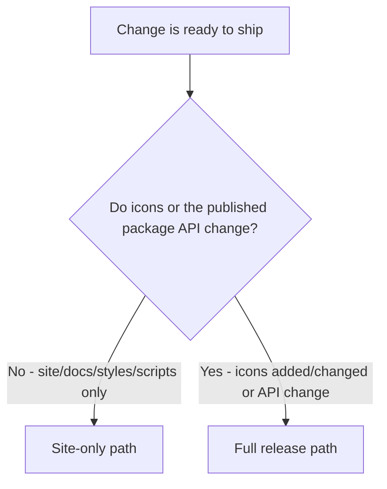

# Release & Publish

Two ways to ship changes in this repo, driven by two independent triggers:

- Push to `main` -> CI + site deploy (uiuxicons.com).
- Push a `vX.Y.Z` tag -> npm publish of `@uiuxicons/react` and `@uiuxicons/vue` (OIDC, no tokens).

## Pick the path



- Site/docs/styles/scripts only, no icon or package API change -> **Site-only path**.
- New or changed icons, or any change npm consumers should receive -> **Full release path**.

When unsure, prefer the full release path if `exports/` or `packages/*/src/` changed.

## Site-only path

For changes that only affect the site, docs, styles, or build scripts:

```bash
git add -A
git commit -m "..."
npm run build          # verify dist/ builds cleanly
git push origin main   # triggers CI + deploy.yml
```

## Full release path

Run these in this exact order (do not run `npm test` before `npm run build`):

```bash
npm run sync                  # update icons.meta.json from exports/ (auto-fills category + enriched tags)
npm run build                 # assigns codepoints + regenerates React/Vue package sources
npm test                      # typecheck + integrity (passes only after build)
npm run release -- minor      # see bump convention below; commits "Release vX.Y.Z" and tags
git push origin main vX.Y.Z   # pushes BOTH refs: main (CI + deploy) and tag (npm publish)
```

### Bump convention

- New or changed icons -> `minor` (icons are additive features).
- Breaking changes -> `major`.
- Fixes only (no new icons/API) -> `patch`.

### What `npm run release` does

- Bumps the version in `package.json`, `packages/react/package.json`, and `packages/vue/package.json` in lockstep, then syncs `package-lock.json` (`npm install --package-lock-only`).
- Runs `npm test`.
- Writes/appends a changelog entry to `changelog/<YYYY-MM-DD>.txt`, format: `Released vX.Y.Z: @uiuxicons/react and @uiuxicons/vue at X.Y.Z, <N> icons.`
- Commits `Release vX.Y.Z` and creates the `vX.Y.Z` tag.
- Does NOT push (pushing the tag is the deliberate publish trigger).

## Gotchas

- `npm run sync` auto-assigns each new icon a `category` (`inferCategory`) and enriched search `tags` (`enrichTags`, from the synonym dictionary in `scripts/categories.js`). Eyeball the new `icons.meta.json` entries; to fine-tune, edit `TOKEN_SYNONYMS`/`NAME_EXTRAS` in `scripts/categories.js` or override `category`/`tags` per-icon in `icons.meta.json` (custom values win and are never overwritten).
- Codepoints are assigned during the build (`buildCodepointMap` in `scripts/font.js`), not by sync. `npm test` only passes after `npm run build`, so never run test between sync and build.
- `npm run release` requires a clean working tree and verifies all three `package.json` versions match before bumping (`scripts/release.js`).
- Pushing `main` triggers CI (`.github/workflows/ci.yml`) and site deploy (`.github/workflows/deploy.yml`). Pushing the `vX.Y.Z` tag triggers npm publish via OIDC (`.github/workflows/publish.yml`). The tag is the only publish trigger.
- `dist/` is generated and gitignored. Never commit it.
- Ignore the `npm warn Unknown env config "devdir"` line in command output. It is sandbox env noise, not a repo issue.

## Verify a release

After the publish workflow finishes:

```bash
npm view @uiuxicons/react version
npm view @uiuxicons/vue version
```

Both should report the new version.
