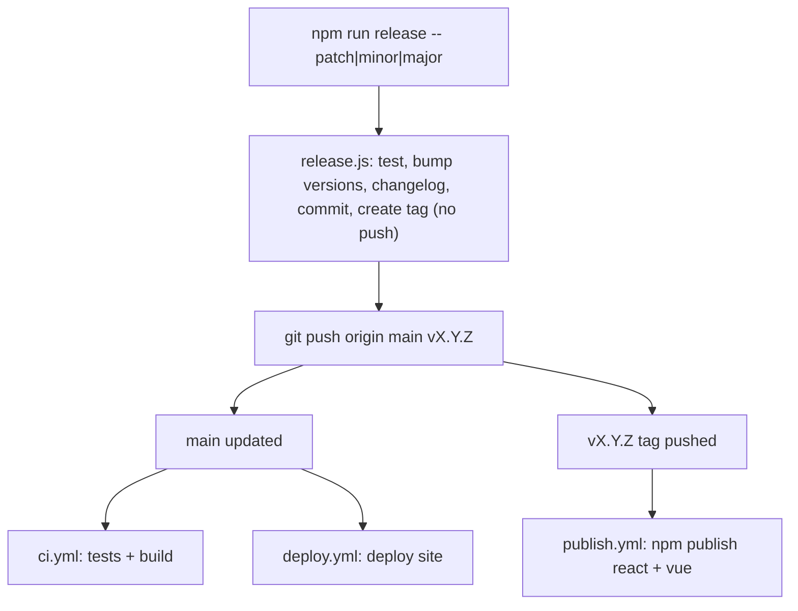

# Contributing to UI/UX Icons

Thanks for helping make this icon library better.

## Requesting an icon

Open an [icon request](https://github.com/uiuxassets/uiuxicons/issues/new?template=icon-request.yml). Concrete use cases help us prioritize.

## Reporting a bug

Open a [bug report](https://github.com/uiuxassets/uiuxicons/issues/new?template=bug-report.yml) with the affected package/area and version.

## Contributing icons or code

1. Fork the repo and create a branch.
2. For icons: add SVGs to all 9 variant folders under `exports/{style}/{weight}/` (line, duotone, solid x light, regular, bold). Icons are 24x24 with `currentColor` - see the [README specs](README.md#specs).
3. Run `npm run sync` to update metadata, then review the generated entries in `icons.meta.json`.
4. Run `npm test` - this typechecks both packages and validates icon-set integrity (all 9 folders must contain identical icon sets).
5. Run `npm run build` to verify the full pipeline passes.
6. Open a pull request. CI must be green before merge.

## What CI checks

Every push and PR runs: TypeScript checks for both packages, the unit and integrity test suites, a full build, and post-build integration tests. Deploys to [uiuxicons.com](https://uiuxicons.com) only happen from `main` after all of these pass.

## Release & deploy flow

Three targets get updated by Git pushes, driven by two independent triggers:

| Target | Trigger | Workflow |
|--------|---------|----------|
| Repo on GitHub | push to `main` | - |
| Live site ([uiuxicons.com](https://uiuxicons.com)) | push to `main` | [`deploy.yml`](.github/workflows/deploy.yml) |
| npm packages (`@uiuxicons/react`, `@uiuxicons/vue`) | push a `vX.Y.Z` tag | [`publish.yml`](.github/workflows/publish.yml) |

CI ([`ci.yml`](.github/workflows/ci.yml)) also runs on every push and PR to `main`.



### Updating the site only (no package release)

For changes that affect only the site, docs, or icons-without-a-release:

1. Make your changes in source (`scripts/`, `styles/`, `exports/`, `docs/`, ...). The `dist/` build output is generated, not committed.
2. Run `npm run build` and verify `dist/` locally.
3. Commit, then open a PR (recommended, so CI runs) or push to `main` if you have permission.
4. The push to `main` triggers `deploy.yml`, which rebuilds and publishes to uiuxicons.com. No npm publish happens without a tag.

### Cutting a release (maintainers)

A full release updates the repo, the site, and the npm packages in one go:

```bash
npm run release -- patch|minor|major   # bumps the 3 package versions in lockstep, runs tests, writes a changelog entry, commits, and tags
git push origin main vX.Y.Z            # pushes BOTH refs: main (-> CI + site deploy) and the tag (-> npm publish)
```

`npm run release` requires a clean working tree and does not push - pushing the tag is the deliberate, manual publish trigger. npm auth uses Trusted Publishing (OIDC), so no tokens or secrets are needed.

## License

By contributing, you agree your contributions are licensed under the [MIT License](LICENSE).
